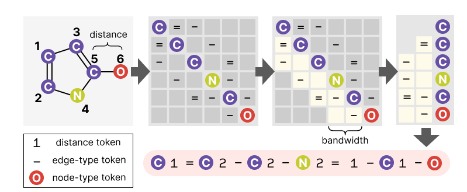

# SNACK (Sequential Notation of Adjacent Connectivity FrameworK)

**SNACK: A Sequential Notation Framework for Probabilistic Graph Generation**

*Hohyun Kim, Hyesung Kim, Min-hwan Oh, Seunggeun Lee*

---

<p align="center">
   
</p>

`snack` is a compact string representation for (attributed) graphs, with helper
utilities to convert between:

- **NetworkX graphs** ↔ **SNACK strings**
- **SMILES / RDKit molecules** ↔ **SNACK strings** (molecular graphs)

Dependencies: `networkx`, `pynauty`, and `rdkit`. The tokenizer and dataset
loader do not require PyTorch or pandas.

## Local installation

Requires Python 3.10 or newer. Replace `<repository-url>` with this repository's
HTTPS clone URL from GitHub:

```bash
git clone <repository-url> snack
cd snack
python -m pip install .
```

If you downloaded a ZIP, extract it and run `python -m pip install .` inside the
extracted repository. Use the directory containing `pyproject.toml`, which is
the repository root; the inner `snack/` directory contains the Python code.


## Examples

### 1) SMILES → SNACK → SMILES (round-trip)

`smiles_to_snack()` uses randomized BFS by default. Set a random seed for
reproducible sequences, or use `ordering=None` to preserve input atom order.

```python
import random
import snack as snk

random.seed(0)
smiles = "CCO"  # ethanol
sn = snk.smiles_to_snack(smiles, ordering="bfs")
smiles_rt = snk.snack_to_smiles(sn, canonical=True)

print("snack:", sn)
print("canonical smiles:", smiles_rt)
```

```text
snack: [C]1-[O]2-[C]
canonical smiles: CCO
```

### 2) NetworkX graph → SNACK → graph

Use bracketed `node_type` labels and raw `edge_type` strings. Graphs may use
arbitrary node IDs; decoding assigns consecutive integer IDs in sequence order.
Input graphs are not modified. Directed graphs, multigraphs, and self-loops
are unsupported.

```python
import random
import networkx as nx
import snack as snk

random.seed(0)
G = nx.Graph()
G.add_node(0, node_type="[A]")
G.add_node(1, node_type="[B]")
G.add_node(2, node_type="[C]")
G.add_edge(0, 1, edge_type="-")
G.add_edge(1, 2, edge_type="=")

sn = snk.graph_to_snack(G, ordering="uniform")
G2 = snk.snack_to_graph(sn)

print(sn)
print(G2.nodes(data=True))
print(G2.edges(data=True))
```

```text
[A][C]2-1=[B]
[(0, {'node_type': '[A]'}), (1, {'node_type': '[C]'}), (2, {'node_type': '[B]'})]
[(0, 2, {'edge_type': '-'}), (1, 2, {'edge_type': '='})]
```

### 3) Non-attributed graphs

`v` denotes a node. Each distance counts positions backward to an earlier node;
`_` denotes an untyped edge. The default layout puts backward edges before
the current node, in descending distance order.

```python
import networkx as nx
import snack as snk

G = nx.Graph()
G.add_edge(0, 1)
G.add_edge(0, 2)
G.add_edge(2, 3)
G.add_edge(2, 4)

sn = snk.graph_to_snack(G)
tokens = snk.split(sn, pattern="token")

print(sn)
print(tokens)
```

```text
v1_v2_v1_v2_v
['v', '1_', 'v', '2_', 'v', '1_', 'v', '2_', 'v']
```

### 4) Weighted graphs and complex edge types

Complex edge types use parentheses. Only `node_type`, `edge_type`, and finite
numeric `weight` attributes are serialized. Use `attributed=False` to retain
only connectivity. Graph labels are preserved literally under node reordering.

```python
import networkx as nx
import snack as snk

G = nx.Graph()
G.add_edge("left", "right", weight=3)
sn = snk.graph_to_snack(G)
print("weighted:", sn)
print("decoded edge:", snk.snack_to_graph(sn).edges[0, 1])

G.edges["left", "right"]["edge_type"] = "contact"
print("type and weight:", snk.graph_to_snack(G))
print("connectivity only:", snk.graph_to_snack(G, attributed=False))
```

```text
weighted: v1(weight=3)v
decoded edge: {'weight': 3}
type and weight: v1(type=contact;weight=3)v
connectivity only: v1_v
```

### 5) RDKit molecule ↔ NetworkX graph ↔ SNACK

```python
from rdkit import Chem
import snack as snk

mol = Chem.MolFromSmiles("CCO")
G = snk.mol_to_graph(mol)
sn = snk.mol_to_snack(mol)

print("snack:", sn)
print("from graph:", snk.graph_to_smiles(G))
print("from snack:", Chem.MolToSmiles(snk.snack_to_mol(sn)))
```

```text
snack: [C]1-[C]1-[O]
from graph: CCO
from snack: CCO
```

`smiles_to_graph()` accepts SMILES directly; `graph_to_mol()` returns an RDKit
molecule. Molecular conversion preserves isotopes and atom maps but omits all
stereochemistry. Dative bonds, invalid valence, and unsupported molecular tokens
raise `ValueError`. Connectivity-only graphs cannot be decoded as molecules.

### 6) Hydrogen counts and molecular conversion options

With `use_hydrogens=True`, every atom includes its hydrogen count, including
`H0` for zero hydrogens. These counts can distinguish a radical from a molecule
whose remaining valence is filled by implicit hydrogens:

```python
import snack as snk

with_h = snk.smiles_to_snack("[CH3]", use_hydrogens=True)
without_h = snk.smiles_to_snack("[CH3]", use_hydrogens=False)

print("with H counts:", with_h, "->", snk.snack_to_smiles(with_h))
print("without H counts:", without_h, "->", snk.snack_to_smiles(without_h))
```

```text
with H counts: [CH3] -> [CH3]
without H counts: [C] -> C
```

Hydrogen counts are omitted by default; separate hydrogen nodes remain in the
graph. `use_charge=True` preserves formal charges, and `kekulize=True` expresses
aromatic bonds using single and double bonds. Omitting hydrogen counts or
charges can change molecular identity or prevent decoding.

### 7) Splitting SNACK: `split`

```python
import random
import snack as snk

random.seed(0)
sn = snk.smiles_to_snack("c1ccccc1", ordering="cm", kekulize=False)  # benzene

tokens = snk.split(sn, pattern="token")
elements = snk.split(sn, pattern="graph")
blocks = snk.split(sn, pattern="block")

print("tokens:", tokens)
print("graph elements:", elements)
print("blocks:", blocks)
```

```text
tokens: ['[C]', '1', 'a', '[C]', '2', 'a', '[C]', '2', 'a', '[C]', '2', 'a', '[C]', '2', 'a', '1', 'a', '[C]']
graph elements: ['[C]', '1a', '[C]', '2a', '[C]', '2a', '[C]', '2a', '[C]', '2a', '1a', '[C]']
blocks: ['[C]', '1a[C]', '2a[C]', '2a[C]', '2a[C]', '2a1a[C]']
```

### 8) Token-level operations: `filter` and `token_type`

```python
import random
import snack as snk

random.seed(0)
sn = snk.smiles_to_snack("c1ccccc1", ordering="bfs", kekulize=False)  # benzene

tokens = snk.split(sn, pattern="token")
node_tokens = snk.filter(sn, key="node_type")
edge_tokens = snk.filter(sn, key="edge_type")
dist_tokens = snk.filter(sn, key="distance")

print("num tokens:", len(tokens))
print("first 10:", tokens[:10])
print("node_type tokens:", node_tokens[:5])
print("edge_type tokens:", edge_tokens[:5])
print("distance tokens:", dist_tokens)
print("types:", [snk.token_type(t) for t in tokens[:10]])
```

```text
num tokens: 18
first 10: ['[C]', '1', 'a', '[C]', '2', 'a', '[C]', '2', 'a', '[C]']
node_type tokens: ['[C]', '[C]', '[C]', '[C]', '[C]']
edge_type tokens: ['a', 'a', 'a', 'a', 'a']
distance tokens: ['1', '2', '2', '2', '2', '1']
types: ['node_type', 'distance', 'edge_type', 'node_type', 'distance', 'edge_type', 'node_type', 'distance', 'edge_type', 'node_type']
```

### 9) Global formatting: node-first vs edge-first, ascending vs descending

Encoding and decoding must use the same `node_first` setting; it is not stored
in the string. The tokenizer captures the settings when it is constructed.

Supported orderings are `None` (input order), `"bfs"`, `"cm"` (Cuthill–McKee),
`"uniform"`, and `"neighbor"`. All named orderings use Python's `random` module.
Graph and RDKit-molecule conversion preserve input order by default.

```python
import random
import snack as snk

random.seed(0)
smiles = "CN1C=NC2=C1C(=O)N(C(=O)N2C)C"  # caffeine

snk.config.set(node_first=False, ascending=False)
s1 = snk.smiles_to_snack(smiles, ordering="neighbor")

random.seed(0)
snk.config.set(node_first=True, ascending=True)
s2 = snk.smiles_to_snack(smiles, ordering="neighbor")

print("edge-first / descending:", s1)
print("node-first / ascending :", s2)
snk.config.set()  # Restore defaults for subsequent examples.
```

```text
edge-first / descending: [C]1-[N]1-[C]1=[O]2-[N]1-[C]2-[C]1-[N]2=[C]1-[N]9-2-[C]1=[O]5=3-[C]4-[C]
node-first / ascending : [C][N]1-[C]1-[O]1=[N]2-[C]1-[C]2-[N]1-[C]2=[N]1-[C]2-9-[O]1=[C]3-5=[C]4-
```

### 10) Automorphism counting on a graph

The result is an exact integer. Node types, edge types, and weights are treated
as graph labels when determining symmetry.

```python
import networkx as nx
import snack as snk

# A 4-cycle has 8 automorphisms (dihedral group D4)
G = nx.cycle_graph(4)
aut = snk.count_automorphisms(G, node_key="node_type", edge_key="edge_type")
print("automorphisms:", aut)
```

```text
automorphisms: 8
```

### 11) Canonical and randomized SMILES

Both helpers return `None` for invalid SMILES.

```python
import random
import snack as snk

random.seed(0)
smi1 = snk.randomize_smiles('c1ccccc1CCC')
smi2 = snk.randomize_smiles(smi1)
canon = snk.canonicalize_smiles(smi1)

print(smi1)
print(smi2)
print(canon)
```

```text
C(C)Cc1ccccc1
C(CC)c1ccccc1
CCCc1ccccc1
```

### 12) SNACK → token IDs → SNACK

```python
import snack as snk

tokenizer = snk.SnackTokenizer("graph", max_nodes=2)
ids = tokenizer.encode("v1_v")

print(ids)
print(tokenizer.decode(ids))
```

```text
[1, 3, 4, 3, 2]
v1_v
```

`encode()` adds `[bos]` (beginning) and `[eos]` (end). Presets provide different
vocabularies:

| Preset | Vocabulary | Default `max_nodes` |
| --- | --- | --- |
| `"graph"` | Non-attributed graphs | 128 |
| `"zinc250k"` | ZINC250k atom types | 38 |
| `"moses"` | MOSES atom types | 27 |
| `"guacamol"` | GuacaMol atom types | 88 |

### 13) Can a node or EOS come next?

`v1_` starts an edge but still needs its next node. A mask entry is `True` when
that token is allowed. `[:-1]` removes EOS so we can continue the sequence.

```python
import snack as snk

tokenizer = snk.SnackTokenizer("graph", ordering="bfs", max_nodes=2)
ids = tokenizer.encode("v1_")[:-1]
mask = tokenizer.next_token_mask(ids)

print("node allowed:", mask[tokenizer.token_to_id["v"]])
print("EOS allowed:", mask[tokenizer.eos_id])
```

```text
node allowed: True
EOS allowed: False
```

### 14) Masks for a whole sequence

`get_logit_mask()` returns the same check at every position. Columns follow
`tokenizer.tokens`; each row describes what can come next after its prefix.

```python
import snack as snk

tokenizer = snk.SnackTokenizer("graph", ordering="bfs", max_nodes=2)
ids = tokenizer.encode("v1_v")
masks = tokenizer.get_logit_mask(ids[:-1])

print("vocabulary:", tokenizer.tokens)
print("after BOS:", masks[0])
print("after v:", masks[1])
print("after v1_:", masks[2])
print("after v1_v:", masks[3])
```

```text
vocabulary: ('[pad]', '[bos]', '[eos]', 'v', '1_')
after BOS: [False, False, False, True, False]
after v: [False, False, True, False, True]
after v1_: [False, False, False, True, False]
after v1_v: [False, False, True, False, False]
```

For training, row `i` predicts `ids[i + 1]`. Before sampling, set model scores
(logits) to `-inf` where the mask is `False`.

### 15) Stop at the node limit

With `max_nodes=2`, completing `v1_v` leaves only EOS allowed.

```python
import snack as snk

tokenizer = snk.SnackTokenizer("graph", ordering="bfs", max_nodes=2)
ids = tokenizer.encode("v1_v")[:-1]
mask = tokenizer.next_token_mask(ids)

print("EOS allowed:", mask[tokenizer.eos_id])
print("another edge allowed:", mask[tokenizer.token_to_id["1_"]])
```

```text
EOS allowed: True
another edge allowed: False
```

Use `allow_disconnected=True` for multiple components. `ordering="bfs"`
restricts generation to BFS order; `ordering=None` disables that constraint.

### 16) Molecular valence masks

An oxygen with no existing bonds can accept a single or double bond, but the
preset blocks a triple bond:

```python
import snack as snk

tokenizer = snk.SnackTokenizer("moses", ordering="bfs")
ids = tokenizer.encode("[O]1")[:-1]
mask = tokenizer.next_token_mask(ids)

print("single bond:", mask[tokenizer.token_to_id["-"]])
print("double bond:", mask[tokenizer.token_to_id["="]])
print("triple bond:", mask[tokenizer.token_to_id["#"]])
```

```text
single bond: True
double bond: True
triple bond: False
```

Molecular presets use `-`, `=`, and `#` bonds and check RDKit validity before EOS.
`valence=False` disables chemical checks. If every mask entry is `False`,
backtrack or restart generation.

### 17) Loading bundled datasets

```python
import snack as snk

data = snk.load_dataset("planar")
train, val, test = data["train"], data["val"], data["test"]
print("split sizes:", len(train), len(val), len(test))
```

```text
split sizes: 128 32 40
```

Each split is a list of SNACK strings. Supported names are `community_small`,
`ego`, `ego_small`, `enzymes`, `grid`, `grid_small`, `lobster`, `planar`, and `sbm`. 
See [dataset details](snack/data/README.md) for details. 

## Not supported

- **Atom chirality:** `@`/`@@` and R/S configurations are not encoded or restored.
- **Bond stereochemistry:** Cis/trans and E/Z information is omitted. Stereo
  double bonds become ordinary `=` bonds, so stereoisomers can share the same
  SNACK representation.
- **Explicit radical states:** Radical-electron counts are not serialized.
  With `use_hydrogens=True`, RDKit can infer radical states from hydrogen counts,
  charges, and bonds. Without these counts, radical information may be lost;
  for example, `[CH3]` becomes `[C]` and decodes as methane.

### Radical example

Hydrogen counts preserve the radical in this example; the default conversion
loses it.

```python
import snack as snk

smiles = "[CH2]c1c[nH]c2ccccc12"
sn = snk.smiles_to_snack(smiles, ordering=None)
sn_h = snk.smiles_to_snack(smiles, ordering=None, use_hydrogens=True)

print("default:", snk.snack_to_smiles(sn))
print("with H counts:", snk.snack_to_smiles(sn_h))
```

```text
default: Cc1c[nH]c2ccccc12
with H counts: [CH2]c1c[nH]c2ccccc12
```

### Chirality example

Atom chirality is lost even when hydrogen counts are preserved.

```python
import snack as snk

smiles = "N[C@@H](C)C(=O)O"
sn = snk.smiles_to_snack(smiles, ordering=None, use_hydrogens=True)
print("decoded:", snk.snack_to_smiles(sn))
```

```text
decoded: CC(N)C(=O)O
```
